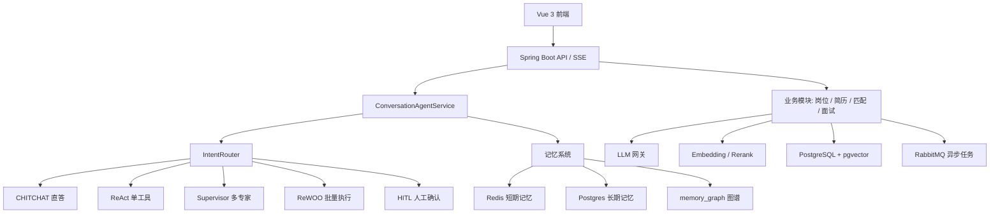

# AI 智能招聘系统

一个基于 Spring Boot 3、AgentScope 2.0、Vue 3 和 pgvector 的 AI 招聘 Agent 项目。系统围绕招聘业务链路构建：岗位管理、简历解析、候选人匹配、面试出题与评估、候选人触达、跨会话记忆和 Agent 对话编排。

项目重点不是做一个简单的“聊天框 + CRUD”，而是把 LLM Agent、向量检索、结构化业务数据和异步任务编排接到真实招聘流程中。

## 核心能力

- **多范式 Agent 编排**：基于意图路由在闲聊直答、单工具 ReAct、Supervisor 多专家协作、ReWOO 批量并行、HITL 人工确认之间切换。
- **简历上传与解析**：支持 PDF、DOCX、TXT；结合 PDFBox、MarkItDown、POI 和扫描件 OCR 兜底，完成文本提取、规则预结构化、LLM 4+1 轮分析和语义分块向量化。
- **候选人匹配**：使用岗位/简历向量召回、方向过滤、rerank 精排、LLM 证据化评分和可配置权重融合，输出候选人排行、匹配证据、能力缺口和面试建议。
- **长期记忆系统**：Redis 短期记忆 + PostgreSQL/pgvector 长期记忆，支持 LLM 自动提取、7 步巩固、标签共现图谱、艾宾浩斯动态 TTL 遗忘和混合检索。
- **面试辅助**：支持面试记录、AI 出题、AI 面试官流式追问、面试状态栏和报告生成。
- **安全与可观测**：Sa-Token RBAC、HITL 高风险确认、提示词注入护栏、工具输出 spotlighting、SSE 层 PII 脱敏、Agent Trace 和 token 统计。

## 技术栈

| 层级 | 技术 |
| --- | --- |
| 后端 | Java 17, Spring Boot 3.4, Spring MVC, WebFlux SSE, MyBatis-Plus |
| Agent | AgentScope 2.0, ReAct, Supervisor, ReWOO, HITL |
| AI 能力 | OpenAI-compatible LLM, Embedding, Rerank, Vision OCR |
| 数据与中间件 | PostgreSQL, pgvector, pg_trgm, Redis, RabbitMQ |
| 前端 | Vue 3, Vite, Ant Design Vue, Pinia, Vue Router, Axios |
| 文件解析 | PDFBox, MarkItDown, Apache POI |
| 安全与观测 | Sa-Token, BCrypt, Actuator, Prometheus, Agent Trace |

## 架构概览



## 项目结构

```text
.
├── demo/
│   ├── src/main/java/com/example/recruit/
│   │   ├── agent/              # Agent 对话、路由、中间件、工具、SSE 事件
│   │   ├── module/             # 招聘业务模块: job/resume/match/interview/identity/task
│   │   ├── memory/             # 短期记忆、长期记忆、巩固、遗忘、混合检索
│   │   ├── infra/              # LLM、Embedding、Rerank、文件解析、可观测
│   │   ├── dal/                # Entity、Mapper、TypeHandler
│   │   └── config/             # 应用配置、数据源、RabbitMQ、Sa-Token
│   ├── src/main/resources/
│   │   ├── sql/                # PostgreSQL/pgvector 建表脚本
│   │   └── application.properties
│   ├── src/test/resources/eval # 离线评估数据集
│   ├── docs/                   # 实现细节、简历亮点、边界说明
│   ├── eval-reports/           # 评估报告
│   └── frontend/               # Vue 3 前端
├── infra/                      # 本地基础设施相关文件
├── LICENSE
└── README.md
```

## 主要业务流程

### 1. Agent 对话

用户通过 `/api/agent/chat/stream` 发起 SSE 对话。系统先写入短期记忆、解析会话，再由 `IntentRouter` 判断任务类型：

- 闲聊或解释类问题直接回答，减少工具链 token 消耗。
- 单一招聘动作进入 ReAct 工具调用。
- 复合任务交给 Supervisor 分派到岗位、简历、匹配、面试等专家 Agent。
- 批量独立任务走 ReWOO，一次规划后并行执行。
- 高风险动作触发 HITL，等待用户确认后继续。

### 2. 简历解析

上传阶段先完成轻量解析和基础字段预填充；深度分析由用户触发后投递 RabbitMQ。消费者依次执行：

1. 结构化抽取
2. 隐性能力洞察
3. 风险识别
4. 潜力评估
5. 结果自校验
6. 全文 Embedding
7. 基本信息、技能、经历、项目、教育等语义块向量化

### 3. 候选人匹配

匹配链路以岗位向量和简历向量/分块向量召回候选池，再结合岗位画像和候选人证据文本做重排与 LLM 评分。最终按权重融合技能、经验、项目、向量、重排和软素质得分，并保存本次权重快照，保证历史结果可追溯。

### 4. 记忆生命周期

系统把会话记忆拆成短期和长期两层：

- 短期记忆使用 Redis List，带 TTL 和摘要压缩。
- 长期记忆存入 PostgreSQL，带 pgvector embedding、importance、tags 和 TTL。
- 巩固任务对记忆做分类、冲突处理、标签提取、图谱边构建、语义合并、重要性评分和摘要。
- 检索使用向量、关键词、图谱游走三路召回，RRF 融合后按时间衰减、重要性和 rerank 排序。
- 命中记忆会刷新访问次数、最后访问时间和 TTL，配合定时清扫实现“常用记忆更持久、低价值记忆逐渐淡出”。

## 离线评估

项目包含意图路由和记忆检索的离线评估数据与报告。

### 记忆检索调优

记忆检索评估使用 32 条人工标注查询，指标为跨查询宏平均的 `Precision@5` 和 `Recall@5`。

| 方案 | Precision@5 | Recall@5 | 说明 |
| --- | ---: | ---: | --- |
| baseline，不加阈值 | 0.4813 | 0.8417 | 召回高，但 Top5 噪声较多 |
| 向量阈值 0.50 + 最终相关性阈值 0.40 | 0.7000 | 0.8000 | 当前较均衡，明显减少无关记忆 |

相关报告：

- `demo/eval-reports/memory-2026-08-05.md`
- `demo/eval-reports/memory-tuning-2026-08-05.md`

> 这些指标来自小规模离线评估集，适合说明工程调优闭环和相对提升，不代表大规模线上准确率。

### 运行评估

```bash
cd demo

# 意图路由核心测试
mvn "-Dtest=IntentRouterTest,IntentRouterSafetyTest" test

# 记忆检索评估，启用推荐阈值
mvn "-Dtest=MemoryRetrievalEvalTest" "-Dapp.memory.vector-min-similarity=0.50" "-Dapp.memory.final-min-direct-match-score=0.40" test
```

## 本地运行

### 环境要求

- JDK 17+
- Maven 3.9+
- Node.js 18+
- PostgreSQL 15/16 + pgvector
- Redis 7+
- RabbitMQ 3+
- 可选：Python + MarkItDown，用于更多文档格式解析

### 启动基础设施

可以使用本地安装的 PostgreSQL、Redis、RabbitMQ，也可以用 Docker 快速启动：

```bash
docker run -d --name recruit-postgres \
  -e POSTGRES_DB=recruit \
  -e POSTGRES_PASSWORD=postgres123 \
  -p 5432:5432 \
  pgvector/pgvector:pg16

docker run -d --name recruit-redis \
  -p 6379:6379 \
  redis:7 redis-server --requirepass redis123

docker run -d --name recruit-rabbitmq \
  -p 5672:5672 \
  -p 15672:15672 \
  rabbitmq:3-management
```

后端启动时会执行 `demo/src/main/resources/sql/schema.sql` 和 `schema_auth.sql`，自动创建表、pgvector/pg_trgm 扩展和种子账号。

### 配置说明

核心配置位于：

```text
demo/src/main/resources/application.properties
```

发布到 GitHub 前，请确认不要提交真实 API Key。建议用环境变量或本地未入库配置覆盖：

```properties
app.ai.api-key=${APP_AI_API_KEY:}
app.embedding.api-key=${APP_EMBEDDING_API_KEY:}
app.rerank.api-key=${APP_RERANK_API_KEY:}
app.vision.api-key=${APP_VISION_API_KEY:}
app.web-search.api-key=${APP_WEB_SEARCH_API_KEY:}
```

如果只想跑通页面和主流程演示，可以开启 mock：

```properties
app.mock.enabled=true
```

真实模式下需要配置 PostgreSQL、Redis、RabbitMQ 和对应的 LLM/Embedding/Rerank Key。

### 启动后端

```bash
cd demo
mvn spring-boot:run
```

默认后端端口：

```text
http://localhost:8888
```

健康检查：

```bash
curl http://localhost:8888/actuator/health
```

### 启动前端

```bash
cd demo/frontend
npm install
npm run dev
```

默认前端地址：

```text
http://localhost:5173
```

## 常用入口

| 功能 | 路径 |
| --- | --- |
| 登录 | `/login` |
| 仪表盘 | `/dashboard` |
| Agent 对话 | `/agent` |
| 岗位管理 | `/jobs` |
| 简历管理 | `/resumes` |
| 候选人匹配 | `/matches` |
| 面试管理 | `/interviews` |
| AI 面试官 | `/interview-agent` |
| 用户管理 | `/users` |

主要后端 API：

| 模块 | API 前缀 |
| --- | --- |
| Agent 对话 | `/api/agent` |
| 会话管理 | `/api/agent/sessions` |
| 岗位 | `/api/jobs` |
| 简历 | `/api/resumes` |
| 匹配 | `/api/matches` |
| 面试 | `/api/interviews` |
| AI 面试官 | `/api/interview-agent` |
| 仪表盘 | `/api/dashboard` |
| 认证 | `/api/auth` |
| 用户管理 | `/api/admin/users` |

## 文档索引

- `demo/docs/项目文档.md`：完整项目架构与模块说明
- `demo/docs/亮点实现细节.md`：重点模块实现细节
- `demo/docs/简历亮点与功能说明.md`：适合写入简历的项目表达与边界
- `demo/docs/意图识别评估边界规范.md`：意图路由标注边界和评估规范
- `demo/eval-reports/`：离线评估报告

## 当前边界

- 部分长任务状态仍保存在进程内存，服务重启后不能恢复任务进度。
- 离线评估集规模有限，当前指标主要用于调优方向验证，不应宣传为线上业务准确率。
- 真实 LLM、Embedding、Rerank、Vision OCR 和 Web Search 均依赖外部服务 Key；缺少 Key 时部分能力会 mock 或降级。
- 文件上传尚未形成完整的文件哈希去重、MIME/魔数校验和解析版本追踪。
- 候选人匹配、面试报告等部分链路仍有可继续工程化的空间，详见 `demo/docs/项目文档.md` 的“当前边界与已知缺陷”。

## License

见 `LICENSE`。
