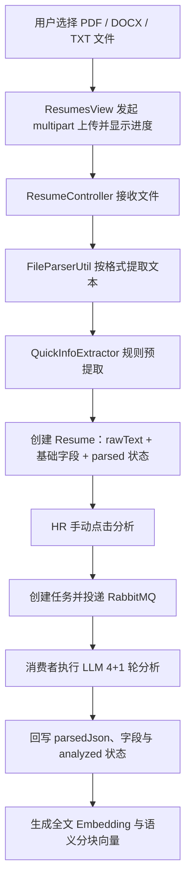
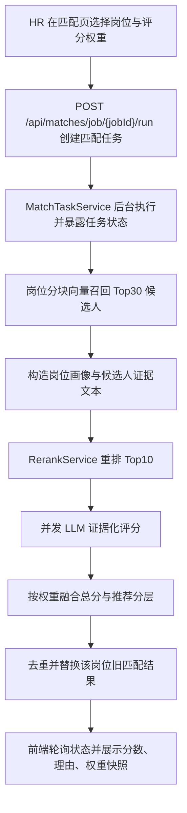

# 项目亮点实现细节

本文档记录项目中已落地模块的实现方式。每个模块先给出整体流程图，再说明关键环节、组件职责、数据沉淀、实现亮点与当前边界；重点说明模块之间的数据流转，不逐行解释代码。

## 简历上传与解析

### 整体流程

### 1. 上传入口与用户反馈

简历列表页的 `ResumesView` 使用上传组件选择单个文件；前端 API 层将文件包装为 `FormData`，通过 `POST /resumes/upload` 发送 `multipart/form-data` 请求。上传过程利用请求的 `onUploadProgress` 回调计算百分比，并以弹窗进度条反馈传输状态。

上传组件的 `beforeUpload` 返回 `false`，因此文件不会被组件自动提交，而是由页面统一调用上传 API。这样页面能够统一控制进度弹窗、成功提示、失败提示，以及上传完成后重新拉取简历列表和筛选项。

上传接口完成只表示“文本已经提取并创建了简历记录”，并不表示 LLM 深度分析、向量生成都已完成。这一状态区分避免用户将文件传输完成误认为候选人资料已经全部智能化处理。

### 2. 文件文本提取与格式分流

`ResumeController` 接到 `MultipartFile` 后，读取文件名和二进制内容，交给 `FileParserUtil` 转换为统一的文本结果。解析器按扩展名选择不同主路径，原因是 PDF 和 Office 文档的内容组织方式不同：

| 文件类型 | 主解析路径 | 降级路径 | 设计目的 |
| --- | --- | --- | --- |
| TXT | UTF-8 直接读取 | 无 | 文本本身已可直接进入后续处理 |
| PDF | PDFBox 提取纯文本 | MarkItDown | PDF 多栏简历若被强转 Markdown，容易出现碎片化表格符号；纯文本通常更利于后续结构化提取 |
| DOCX / DOC / PPT / XLS / HTML 等 | MarkItDown 转 Markdown | DOCX 可回退 POI | Office 文档往往存在标题、列表、表格等语义结构，Markdown 更容易保留这些关系 |

MarkItDown 路径会把上传的字节临时写成带原始扩展名的文件，再用 `ProcessBuilder` 调用项目中的 Python 脚本，让 MarkItDown 按文件类型解析并把结果输出到标准输出。Java 服务读取结果后删除临时文件；这使 Java 主服务可以复用更适合多格式文档转换的 Python 工具，而不把各种格式解析逻辑全部耦合到业务层。

解析结果统一为 `rawText`，后面的规则提取、LLM 分析和向量化都只面对这一份文本，而无需关心原始文件来自 PDF 还是 DOCX。该统一边界是后续扩展新格式、替换解析器或增加 OCR 的基础。

### 3. 快速预结构化与初始入库

文本提取完成后，`QuickInfoExtractor` 用正则快速扫描常见简历字段：姓名、手机、邮箱、学历、学校、专业、工作年限和意向岗位。其作用不是得到最终可信的完整画像，而是在不依赖大模型的前提下，为新导入简历立即生成可浏览、可筛选的基础信息。

`ResumeController` 将预提取字段和完整 `rawText` 组装为 `Resume` 对象并保存。姓名未能从文本提取时，会尝试使用文件名生成兜底名称；初始状态写为 `parsed`。此时数据库中同时保留两类数据：

- 独立列：候选人姓名、联系方式、教育、专业、年限、意向岗位等，供列表展示、条件筛选和普通查询使用。
- 原始与扩展字段：`rawText` 保存统一文本；`parsedJson` 预留给深度分析的完整 JSON 结果；`embedding` 与文档分块表用于后续语义检索。

这种“先快速建立记录、再增量完善”的处理方式，使上传接口不必等待大模型调用，也避免解析失败时丢失最基本的原始文本和已提取信息。

### 4. 深度分析的触发、异步任务与前端轮询

深度分析不是上传后的自动动作，而是 HR 在简历列表点击“分析”后执行。前端调用 `POST /resumes/{resumeId}/analyze`：

1. 在真实模式且 RabbitMQ 可用时，`ResumeAnalysisController` 创建 `RESUME_ANALYSIS` 类型的任务消息及任务状态，将消息发送到分析交换机；接口立即返回 `taskId` 与 `PENDING` 状态，不等待分析结束。
2. 页面拿到 `taskId` 后每 2 秒查询一次任务状态，最多轮询 90 次。状态变为 `SUCCESS` 时关闭加载提示并刷新列表；状态为 `FAILED` 时提示失败。
3. 在 mock 模式或 RabbitMQ 未注入的降级场景，控制器会直接同步调用分析服务并返回结果对象；前端据返回中是否存在 `taskId` 区分同步和异步响应。

这里的异步边界解决的是 LLM 多轮调用、Embedding 生成和分块写入可能耗时较长的问题。Web 请求只负责提交任务和返回任务标识，消费者负责长耗时处理；前端以轮询方式把最终状态反馈给用户。

### 5. RabbitMQ 消费者编排后续处理

`AnalysisTaskConsumer` 消费 `RESUME_ANALYSIS` 消息后按固定顺序执行三件事：先调用 `ResumeAnalysisService.analyzeFull` 产生结构化分析结果；再为完整简历文本生成 Embedding；最后调用 `DocumentChunkService` 按语义分块并生成每块的 Embedding。

消费者把“分析结果生成”和“检索数据构建”串联在同一个任务中，保证一份简历标记为深度分析后，正常情况下既有可展示的结构化结果，也具备检索所需的向量数据。向量生成失败会被记录，不影响已完成的结构化分析结果回写；因此可避免单一向量服务异常导致整份简历完全不可用。

任务状态由 `TaskStatusManager` 维护，供前端轮询读取。它承担的是交互期的进度反馈职责，而不是长期任务审计或可恢复的任务存储。

### 6. LLM 4+1 轮分析与字段回写

`ResumeAnalysisService.analyzeFull` 首先读取简历的 `rawText`；文本为空时直接终止，因为后续模型分析没有可依赖的输入。随后依次完成以下 4+1 个阶段：

1. **结构化抽取（第 1 轮）**：提取基本信息、技能、工作经历、项目经历和教育经历等，生成统一的 `StructuredData`。意向岗位类别会按系统定义的岗位分类输出，降低自由文本对后续筛选和匹配的影响。
2. **隐性洞察（第 2 轮）**：基于原文和结构化结果补充候选人的能力信号、经验特征等非直接字段。
3. **风险识别（第 3 轮）**：识别简历中需要招聘人员进一步核验的风险信息，而不是直接替代人工决策。
4. **潜力评估（第 4 轮）**：结合结构化结果与隐性洞察形成潜力判断。
5. **结果自校验（+1 轮）**：检查前述各部分的整体一致性，形成校验结论。

第 1 轮的结构化字段会用于修正规则预提取值：只有 LLM 给出了非空字段时才覆盖简历表中的对应列；若模型没有给出该字段，原有正则结果会保留。这个“非空覆盖”策略避免模型偶发遗漏把上传阶段已得到的信息清空。

服务将各轮结果、校验结论和分析时间序列化后写入 `parsedJson`，再将简历状态更新为 `analyzed`。其中独立字段便于业务查询，`parsedJson` 保留了更完整的分析上下文，二者服务于不同读写场景。

### 7. 全文与语义分块向量化

分析完成后，消费者使用 `EmbeddingService` 对 `rawText` 生成全文向量，并写回简历的 `embedding` 字段。全文向量适合做“这份简历整体和岗位/JD 是否相近”一类的粗粒度语义比较。

随后 `DocumentChunkService` 先清理该简历已有的旧分块，再从 `parsedJson` 中组织五类语义段：`basic_info`、`skills`、`work_exp`、`projects`、`education`。每一段独立生成向量并写入文档分块存储；如果还没有结构化 JSON，则以完整 `rawText` 作为 `full` 单块兜底。

分块向量与全文向量的用途不同：全文向量利于整体召回和匹配，语义块向量利于按技能、项目或经历定位证据。后续 RAG 或候选人匹配不必把整份简历一次性塞入上下文，而可以检索到与问题最相关的一段内容。

### 8. 关键组件职责

| 组件 | 职责 | 主要输入 | 主要输出 |
| --- | --- | --- | --- |
| `ResumesView` / `resumes.js` | 发起上传、显示传输进度、触发分析并轮询任务 | 用户文件、简历 ID | 上传请求、任务状态的交互反馈 |
| `ResumeController` | 校验空文件、编排文本提取与快速入库 | `MultipartFile` | `parsed` 状态的简历记录 |
| `FileParserUtil` + `parse_resume.py` | 按格式抽取并统一为文本 | 文件名、字节流 | `rawText` |
| `QuickInfoExtractor` | 低延迟规则预提取 | `rawText` | 基础候选人字段 |
| `ResumeAnalysisController` | 在同步降级与 MQ 异步模式之间路由 | 简历 ID | 分析结果或 `taskId` |
| `AnalysisTaskConsumer` | 编排 LLM 分析、全文向量与分块 | 任务消息 | 更新后的简历与文档块 |
| `ResumeAnalysisService` | 4+1 轮解析、字段保护性回写 | `rawText`、简历记录 | `parsedJson`、`analyzed` 状态 |
| `DocumentChunkService` | 重建语义分块及分块向量 | `parsedJson` / `rawText` | 可检索的分块数据 |

### 实现亮点

- **格式差异驱动的解析策略**：PDF 与 Office 文档并不共用单一解析器，而是根据版式和语义结构选主路径、留回退路径，减少多栏 PDF 或带表格 Office 文档的文本质量损失。
- **快速可用与深度处理解耦**：上传后即能得到基础简历记录；慢速的多轮模型分析和向量化通过显式触发的异步任务执行，兼顾页面响应速度与处理深度。
- **规则提取与模型提取分层协作**：规则保证低延迟和基础可用性，模型负责补充复杂信息；非空覆盖规则又保护了已有数据，不让模型缺失值破坏初始结果。
- **一份数据服务两类场景**：独立字段和 JSON 结果服务于表格展示、筛选和人工查看；全文/分块向量服务于语义检索、RAG 和候选人匹配。
- **面向后续检索的语义切块**：不是简单按固定字符数切文档，而是按基本信息、技能、工作、项目、教育等业务语义组织内容，便于检索结果直接定位到可解释的简历证据。

### 当前边界

- 上传成功后不自动启动深度分析、Embedding 或分块；当前产品流程需要 HR 再次点击“分析”。
- 扫描件 PDF 尚未接入可靠 OCR，无法保证图片型简历的文本提取质量。
- MarkItDown 通过子进程调用，但当前实现没有明确的执行超时、标准输出大小限制和解析质量阈值；异常或空文本需要进一步形成更严格的失败状态处理。
- 文件名/扩展名之外缺少明确的 MIME、魔数和白名单校验；不支持格式可能被当作 UTF-8 文本处理，从而产生无效简历记录。
- 原始文件本体、文件哈希、解析器版本尚未完整持久化，不利于重新解析、版本追踪和上传去重。
- 任务状态由内存中的 `TaskStatusManager` 管理，服务重启后不能恢复；消息队列路径也尚未形成重试、死信、幂等与重放的完整治理。
- 当前分析结果虽然有自校验和错误日志，但尚无人工确认、置信度评分或统一的结果质量评估闭环；不应据此宣称模型解析准确率或自动化招聘决策能力。

## 候选人匹配

### 流程说明

1. **匹配入口与权重配置**：HR 在 `MatchesView` 选择岗位，并可调整技能、经验、项目、向量、重排和软素质六类评分权重；前端要求合计为 100% 后才允许发起匹配。`POST /api/matches/job/{jobId}/run` 接收可选 `weights` 请求体，后端将其归一化为百分比权重。
2. **异步任务与状态恢复**：`CandidateMatchController` 不直接阻塞等待完整匹配，而是交给 `MatchTaskService` 启动后台任务；`GET /api/matches/job/{jobId}/task` 返回 `RUNNING/SUCCESS/FAILED`、任务时间和本次权重快照。前端每 2.5 秒轮询任务状态，因此用户切换页面再回来时仍能看到“匹配中”状态。
3. **向量召回候选池**：`CandidateMatchService` 先加载岗位画像，优先调用 `VectorSearchService.searchCandidatesByJob` 进行岗位分块与简历同类型分块的语义召回，取 Top30；当岗位分块不存在或召回为空时，降级为岗位整体向量与简历向量的召回。方向过滤来自岗位标题和岗位解析 JSON 中的类别信息。
4. **文本重排与证据组织**：服务用岗位标题、部门、职级、地点、年限、学历、技能、职责、项目背景和要求构造 `rerankQuery`，同时从候选人结构化简历中提取基本信息、技能、经历、项目、教育、风险和潜力信息，形成候选人证据文本。候选池数量大于直接评估阈值时，`RerankService.rerankWithScore` 调用百炼 rerank；mock 或失败场景会按原向量顺序降级。
5. **证据化 LLM 评分与融合**：重排后的 Top10 进入 LLM 评估，候选人之间最多 4 个并发执行。LLM 输出技能、经验、项目、软素质分，以及匹配证据、缺口、风险和面试追问；最终分由 `MatchWeights` 按本次权重融合，并生成 `STRONG_RECOMMEND / RECOMMEND / REVIEW / WEAK / REJECT` 分层。
6. **结果持久化与展示**：保存本轮结果前会删除该岗位旧匹配记录，并按 `resume_id` 兜底去重，避免同一份简历重复占名额。`match_details` 保存版本号、分数拆解、召回/重排信号、LLM 解释、推荐决策和 `weightConfig` 权重快照；前端列表展示排行，详情展示评分明细、解释证据和本次评分权重。

### 实现亮点

- **召回与精排职责分离**：向量召回负责扩大候选池，rerank 负责比较岗位画像与候选人证据文本的细粒度相关性，LLM 评分再输出可展示的证据、缺口和追问，避免单一向量分数承担全部决策解释。
- **无硬性资格淘汰的柔性筛选**：流程不在前置阶段删除缺少个别技能的候选人，而是在 LLM 评分和 `gaps/risks` 中表达不足；这更适合“技能略缺但项目和经验很强”的招聘场景。
- **可配置且可追溯的分数融合**：前端自定义权重会随任务提交，后端归一化后参与最终分计算，并把权重快照写入每条结果的 `match_details.weightConfig`，使历史分数不会因后续权重调整而失去解释依据。
- **交互层异步化**：匹配过程包含重排和多次 LLM 调用，后端用任务服务托管长耗时流程，前端通过状态接口恢复“匹配中”状态，避免页面内存状态丢失导致重复触发匹配。
- **重复结果治理**：新一轮匹配会替换该岗位旧记录，查询时也按 `resume_id` 兜底保留最新/最高展示结果，避免历史匹配记录或同一简历多次入库结果挤占 TopN 名额。

### 当前边界

- `MatchTaskService` 的任务状态仍是内存态，服务重启后无法恢复正在执行或刚完成的任务状态；适合演示和单实例使用，尚未做数据库或 Redis 持久化任务表。
- 当前只能去重同一个 `resume_id` 的重复匹配记录；如果同一个 PDF 被重复上传成多条 `resume` 记录，仍需要在上传阶段增加文件哈希或文本指纹去重。
- 方向过滤基于岗位标题、类别和简历文本的字面匹配，属于较松的预过滤；它不能替代严格的岗位资格校验，也不应被表述为确定性的硬筛规则。
- rerank 在候选池数量不超过直接评估阈值时会跳过，真实 rerank 接口失败或缺少 key 时会降级为原向量顺序或 mock 排序。
- LLM 评分失败时会使用向量和重排信号生成降级分数；系统提供解释和推荐分层，但没有形成已验证的录用准确率、在线学习闭环或自动招聘决策能力。
